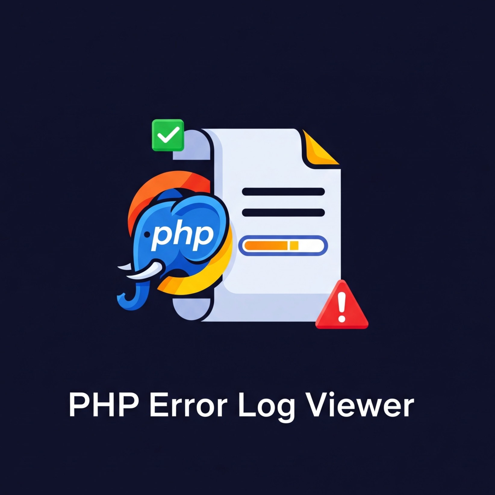
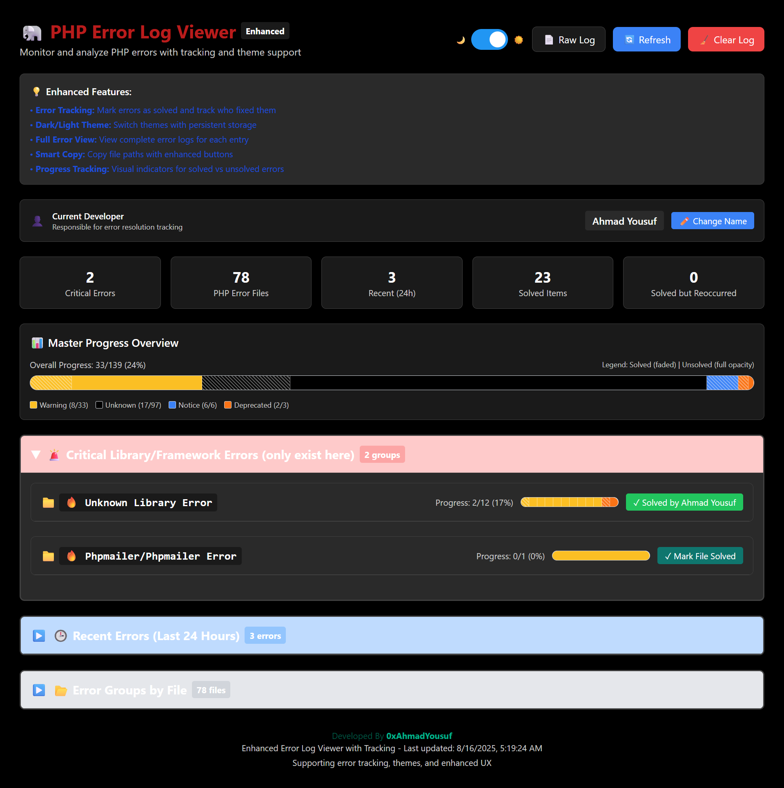
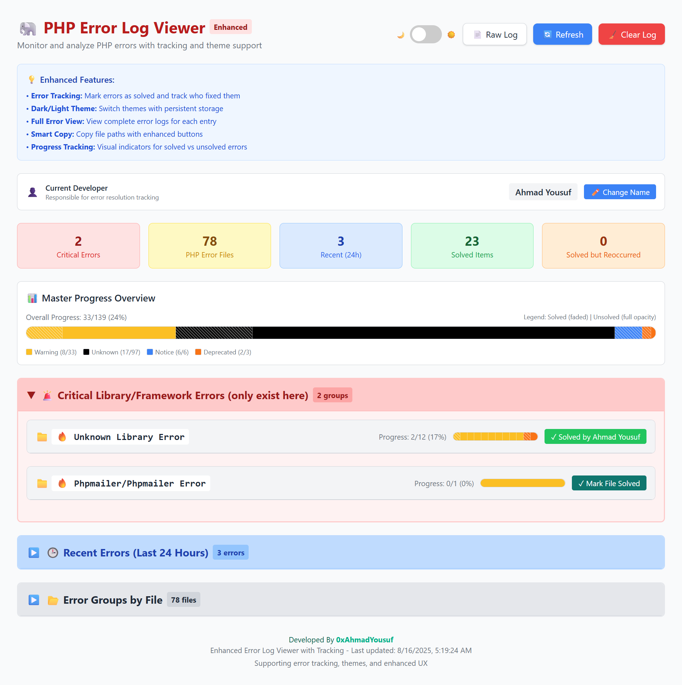
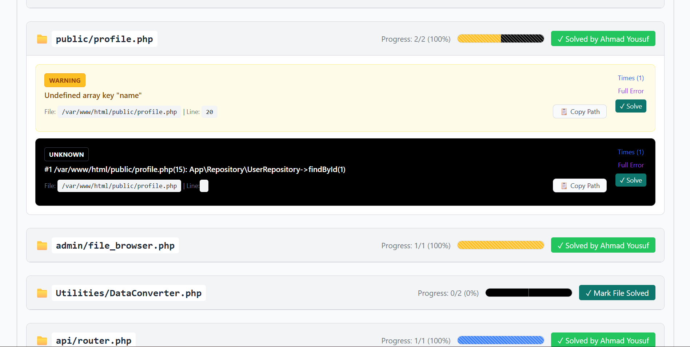

# PHP Error Log Viewer 🐘

[](https://github.com/0xAhmadYousuf/PHP-Error-Log-View)
[](https://github.com/0xAhmadYousuf/PHP-Error-Log-View/stargazers)
[](https://github.com/0xAhmadYousuf/PHP-Error-Log-View/network)

A **professional, feature-rich PHP Error Log Viewer** with advanced tracking, progress monitoring, and beautiful dark/light themes. Perfect for developers who want to efficiently monitor, track, and resolve PHP errors with a modern, intuitive interface.

<p align="center">
  
</p>

## ✨ Features

### 🎯 **Core Functionality**
- **Real-time Error Parsing**: Automatically parses and categorizes PHP error logs
- **Multi-file Error Support**: Handles errors from multiple PHP files and libraries
- **Smart Error Grouping**: Groups similar errors for better organization
- **Stack Trace Analysis**: Detailed stack trace viewing for complex errors
- **Error Log Clearing**: One-click error log cleanup with confirmation

### 📊 **Advanced Tracking & Progress**
- **Error Resolution Tracking**: Mark errors as solved with developer attribution
- **Reoccurrence Detection**: Automatically detects when solved errors occur again
- **Visual Progress Bars**: Segmented progress bars with diagonal stripes for solved errors
- **Master Progress Overview**: Comprehensive dashboard showing overall error resolution status
- **Developer Identity Management**: Track who solved which errors with persistent cookie storage

### 🎨 **Modern UI/UX**
- **Dark/Light Theme Toggle**: VS Code-style themes with smooth transitions
- **Responsive Design**: Works perfectly on desktop, tablet, and mobile devices
- **Color-coded Error Types**: Instant visual identification of error severity
  - 🔴 **Fatal/Error**: Red tags with shadows
  - 🟡 **Warning**: Yellow tags with shadows
  - 🔵 **Notice**: Blue tags with shadows
  - 🟠 **Deprecated**: Orange tags with shadows
  - 🟣 **Parse**: Purple tags with shadows
- **Collapsible Sections**: Organized sections with persistent state
- **Modal Error Details**: Full error content in beautiful modal windows

### 🔧 **Developer Tools**
- **One-click File Path Copying**: Quick access to error file locations
- **Error Hash Generation**: Unique identification for each error type
- **JSON Export/Import**: Solved errors data persistence
- **Recent Errors Filter**: 24-hour error view for immediate issues
- **Critical Error Highlighting**: Special treatment for vendor/library errors

### 📈 **Analytics & Insights**
- **Error Statistics**: Real-time counts of different error types
- **Progress Tracking**: Visual indicators for team productivity
- **Time-based Filtering**: Focus on recent errors that need attention
- **Reoccurrence Alerts**: Immediate notification when solved errors return

## 🚀 Quick Installation

### Method 1: One-Click Installer (Recommended)

Create a file called `install.php` in your web root and run it:

```php
<?php
// PHP Error Log Viewer Installer
$repo = 'https://github.com/0xAhmadYousuf/PHP-Error-Log-View/archive/refs/heads/main.zip';
$zip = 'error-viewer.zip';
$target = './error-viewer/';

echo "📥 Downloading PHP Error Log Viewer...\n";
file_put_contents($zip, file_get_contents($repo));

$za = new ZipArchive();
if ($za->open($zip) === TRUE) {
    $za->extractTo('./');
    $za->close();
    rename('./PHP-Error-Log-View-main/src', $target);
    unlink($zip);
    rmdir('./PHP-Error-Log-View-main');
    echo "✅ Installation complete! Visit: " . $_SERVER['HTTP_HOST'] . "/error-viewer/\n";
} else {
    echo "❌ Installation failed. Please download manually.\n";
}
?>
```

### Method 2: Manual Installation

1. **Download the repository**:
   ```bash
   git clone https://github.com/0xAhmadYousuf/PHP-Error-Log-View.git
   ```

2. **Copy files to your web directory**:
   ```bash
   cp -r PHP-Error-Log-View/src/* /path/to/your/webroot/error-viewer/
   ```

3. **Set permissions**:
   ```bash
   chmod 755 /path/to/your/webroot/error-viewer/
   chmod 666 /path/to/your/webroot/error-viewer/solved_errors.json
   ```

4. **Access the viewer**:
   Navigate to `http://yourdomain.com/error-viewer/`

## 📁 File Structure

```
src/
├── index.php              # Main application file
├── template.html          # UI template with themes and styling
├── update_error_status.php # API endpoint for marking errors as solved
├── solved_errors.json     # Persistent storage for solved errors
└── error_log              # Your PHP error log file
```

## 🛠️ Configuration

### Basic Setup
1. **Error Log Path**: Place your `error_log` file in the same directory as `index.php`
2. **Permissions**: Ensure web server can read `error_log` and write to `solved_errors.json`
3. **Developer Name**: First-time visitors will be prompted to enter their name for tracking

### Advanced Configuration
- **Theme Persistence**: Uses cookies to remember user preferences
- **Section State**: Remembers collapsed/expanded sections
- **Developer Identity**: Persistent developer name storage
- **Error Resolution**: JSON-based solved error tracking

## 🎯 Usage Guide

### 1. **Viewing Errors**
- **Recent Errors**: View errors from the last 24 hours
- **Error Groups**: Browse errors organized by file
- **Critical Errors**: Focus on vendor/library issues
- **Full Error Details**: Click "👁️ View Full" for complete error information

### 2. **Tracking Progress**
- **Mark as Solved**: Click ✓ button next to errors or files
- **Progress Bars**: Visual indicators show solved vs unsolved errors
- **Master Overview**: Dashboard showing overall project health

### 3. **Managing Reoccurrences**
- **Automatic Detection**: System detects when solved errors occur again
- **Reoccurrence Details**: Click ⚠️ badges for solve history
- **Re-marking**: Easily re-mark reoccurred errors as solved

### 4. **Customization**
- **Theme Toggle**: Switch between dark/light modes
- **Section Management**: Collapse/expand sections as needed
- **Developer Identity**: Change your name for proper attribution

## 🔒 Security Features

- **Input Sanitization**: All user inputs are properly sanitized
- **XSS Protection**: HTML entities encoding for all dynamic content
- **Safe File Operations**: Secure file read/write operations
- **Cookie Security**: Secure cookie handling for preferences

## 🌟 Screenshots

### Dark Theme with Progress Bars
<p align="center">
  
</p>

### Light Theme Dashboard
<p align="center">
  
</p>

### Error Details Modal
<p align="center">
  
</p>

## 🤝 Contributing

We welcome contributions! Please see our [Contributing Guidelines](CONTRIBUTING.md) for details.

### Development Setup
1. Fork the repository
2. Create a feature branch: `git checkout -b feature/amazing-feature`
3. Commit your changes: `git commit -m 'Add amazing feature'`
4. Push to the branch: `git push origin feature/amazing-feature`
5. Open a Pull Request

## 📝 License

This project is licensed under the MIT License - see the [LICENSE](LICENSE) file for details.

## 👨‍💻 Author

**Ahmad Yousuf** - [0xAhmadYousuf](https://github.com/0xAhmadYousuf)
- Website: [0xAhmadYousuf.com](https://0xAhmadYousuf.com)
- Twitter: [@0xAhmadYousuf](https://twitter.com/0xAhmadYousuf)

## 🚀 Support

If you found this project helpful, please consider:
- ⭐ Starring the repository
- 🐛 Reporting bugs
- 💡 Suggesting new features
- 📢 Sharing with other developers

## 📋 Requirements

- **PHP 8.0+** (uses match expressions and modern PHP features)
- **Web Server** (Apache, Nginx, or built-in PHP server)
- **JSON Extension** (usually enabled by default)
- **File System Access** (read/write permissions)

## 🔧 Troubleshooting

### Common Issues

**Q: Errors not showing up?**
A: Ensure your `error_log` file is in the same directory and has proper read permissions.

**Q: Can't mark errors as solved?**
A: Check that `solved_errors.json` has write permissions (chmod 666).

**Q: Theme not persisting?**
A: Verify that cookies are enabled in your browser.

**Q: Progress bars not updating?**
A: Refresh the page after marking errors as solved.

### Performance Tips

- **Large Log Files**: For logs over 10MB, consider rotating or archiving old entries
- **Memory Usage**: PHP memory limit may need adjustment for very large error logs
- **Caching**: Browser caching is optimized for static assets

## 🔄 Changelog

### Version 2.0.0 (Latest)
- ✨ Added segmented progress bars with diagonal stripes
- 🎨 Implemented color-coded error type tags
- 🌙 Enhanced dark mode with colored shadows
- 🔍 Added reoccurrence detection and tracking
- 📊 Master progress overview dashboard
- 🔧 Improved error parsing and categorization

### Version 1.0.0
- 🎉 Initial release with basic error viewing
- 🎨 Dark/light theme support
- 📝 Error marking and tracking
- 📱 Responsive design

---

<div align="center">
  <strong>Made with ❤️ by <a href="https://0xAhmadYousuf.com">Ahmad Yousuf</a></strong>
  <br>
  <sub>🚀 Helping developers build better PHP applications</sub>
</div>
